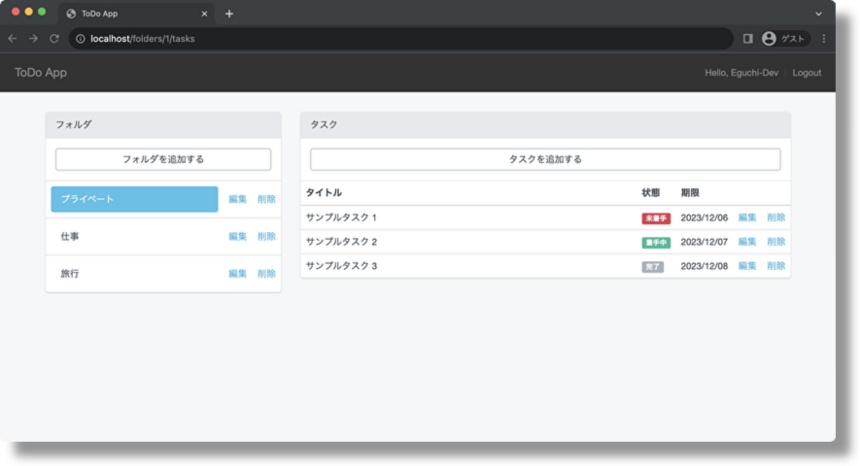

# ポートフォリオ

## 概要
Laravel9で実装したToDoアプリケーションです。  
ZennのWEB書籍を執筆するために制作しました。  
アプリ名：ToDoApp   
WEB書籍：[Laravel入門 - Laravelを使ってみよう!](https://zenn.dev/eguchi244_dev/books/laravel-tutorial-books)



## 制作経緯
本アプリとWEB書籍はLaravel9のチュートリアル教材として活用したいという気持ちから制作しました。 

制作にあたっては下記の項目を

* Dockerによる環境構築の高速化
* CRUDを網羅するアプリケーションを制作する
* 認証機能を実装する
* メール機能を実装する
* リッチUIを実現する

満たす体験を実現するようにしました。

## システム構成
【システム構成】
* フレームワーク ： Laravel Framework 9.x.x
* フロントエンドビルドツール：LaravelMix
* 認証ライブラリ ： Laravel/ui
* データベース ： MYSQL 5.7.36
* DB管理ツール ： phpMyAdmin latest
* PHP ： PHP 8.0.x
* Nginx ： Nginx latest
* Node.js ： node 14.18-alpine
* mail ： mailhog latest

【ディレクトリ構成】
```
Laravel9-Tutorial-PJ（ルートディレクトリ）
├── docker-compose.yml
├── docker 
│   ├── php 
│   │   ├── Dockerfile 
│   │   └── php.ini 
│   └── nginx 
│       └── default.conf 
├── phpMyAdmin
└── src 
    └──  Laravel9TaskList
```

## 前提条件
PCに下記がインストールと設定がされていること。

* Linux/Unix開発環境
   * Windows ： WSL2（Ubuntu）, Curl
   * Mac ： HomeBrew
* Docker, Docker-compose
* composer
* npm 

## 環境構築
Github からローカル環境に構築するための手順です。  
任意の作業フォルダ内で下記を実施してください。

1. GitHubよりプロジェクトをダウンロードする
```
$ git clone https://github.com/eguchi244/Laravel9-Tutorial-PJ.git
$ cd Laravel9-Tutorial-PJ
```
2. Dockerをビルドする
```
$ docker-compose up -d
```
3. Laravel(PHP)のセットアップをする
```
# PHPコンテナにログインする
$ docker-compose exec php bash
root@~# cd Laravel9TaskList
# Composer（PHPパッケージ）をインストールしてVenderフォルダを作成する
root@~# composer install
# .env.example ファイルをコピーして .env ファイルを生成する
root@~# cp .env.example .env
# キージェネレートする
# これを行わないと起動時に「No application encryption key has been specified.」エラーが表示される
root@~# php artisan key:generate
# インストールの確認をする
root@~# php artisan --version
# 念の為に権限を与える
# PermissionDeniedエラーがでる場合の対処方法
root@~# chown www-data ./storage -R
# PHPコンテナからログアウトする
root@~# exit
```
4. ポートが競合する場合は 必要に応じて .env ファイルを編集する
- ポートが競合する場合は下記のような書き方で競合しないポートに書き換えてください
```
APP_URL=http://localhost:8880
APP_PORT=8880
```
- .env を書き換えてる場合は再度ターミナルでキージェネレートする
```
# PHPコンテナにログインする
$ docker-compose exec php bash
root@~# cd Laravel9TaskList
# キージェネレートする
root@~# php artisan key:generate
# PHPコンテナからログアウトする
root@~# exit
```

5. migrationとSeeederを実行する
```
# PHPコンテナにログインする
$ docker-compose exec php bash
root@~# cd Laravel9TaskList
# migrationを実行する
root@~# php artisan migrate:fresh
# Seeederを実行する
root@~# php artisan db:seed
# PHPコンテナからログアウトする
root@~# exit
```
6. データーベースを確認する
```
# DBコンテナにログインする
$ docker-compose exec db bash
# MySQLにログインする(.envでアカウントを確認する)
root@~# mysql -u <ユーザー名> -p --default-character-set=utf8mb4
Enter password: <DBのパスワードを入力> 
# DBを確認する
mysql> show databases;
# DBを選択する
mysql> use mysql_test_db;
# テーブルを確認する
mysql> SHOW TABLES;
# foldersテーブルのデータを確認する
mysql> SELECT * FROM folders;
# tasksテーブルのデータを確認する
mysql> SELECT * FROM tasks;
# MySQLからログアウトする
mysql> quit
# DBコンテナからログアウトする
root@~# exit
```

## 動作確認
1. ToDoAppのログインテストをする
- UsersTableSeeder.phpからユーザーアカウントを確認してログインしてください  
ブラウザに [http://localhost/login](http://localhost/login) でアクセスしてログインする  
2. phpMyAdmin（DB管理ツール）　の表示を確認する  
ブラウザに [http://localhost:8080](http://localhost:8080) でアクセスして表示されればOKです。
3. Mailhog（メールテストサーバ）の表示を確認する   
ブラウザに [http://localhost:8025](http://localhost:8025) でアクセスして表示されればOKです。
